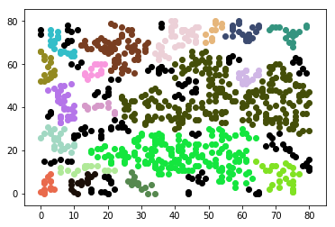

```python
from random import randint,uniform, sample
import math, numpy as np, copy
import matplotlib.pyplot as plt

# Varibles
data = []
neighboor = {}
```


```python
for i in range(0,1000):
    data.append([randint(0,80), randint(0,80)])


points = copy.deepcopy(data)
```


```python
# DBSCAN Variable
eps = 3
minPts = 10

# Search Neighbor
def searchNeighbors(point, flag):
    points.remove(point)
    
    key = str(point)
        
    for item in points:
        sub = np.subtract(item,point)
        sub = math.pow((math.pow(math.fabs(sub[0]),2))+(math.pow(math.fabs(sub[1]),2)),0.5)
        if(sub < eps):
            #n.append([point, item])
            
            if key not in neighboor and str(flag) not in neighboor: 
                neighboor[key] = [point]
                neighboor[key].append(item)
            else : 
                neighboor[str(flag)].append(item)
                
            searchNeighbors(item, flag)

```


```python
# dbscan iteration
for datum in points:
    searchNeighbors(datum, datum)

```


```python
# Plotting
for i,n in enumerate(neighboor):
    #print("key: "+n)
    r = lambda: randint(0,255)
    
    if(len(neighboor.get(n)) >= minPts): col = '#%02X%02X%02X' % (r(),r(),r())
    else: col = '#000000'
        
    for item in neighboor[n]:
        #print("\t-->"+str(item))
        plt.scatter(item[0],item[1], color = col)
plt.show()
```




